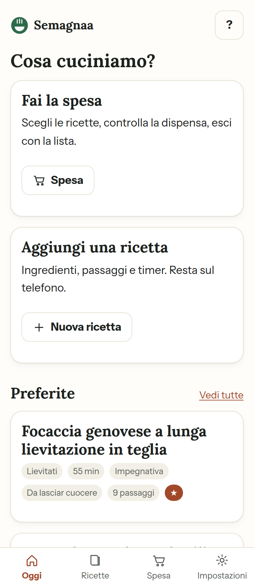
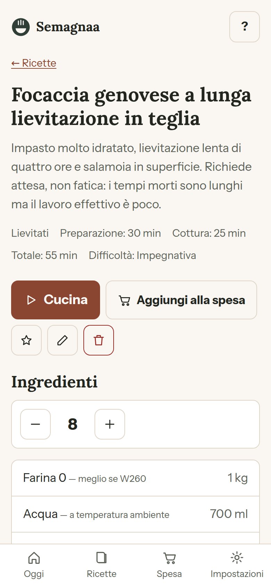
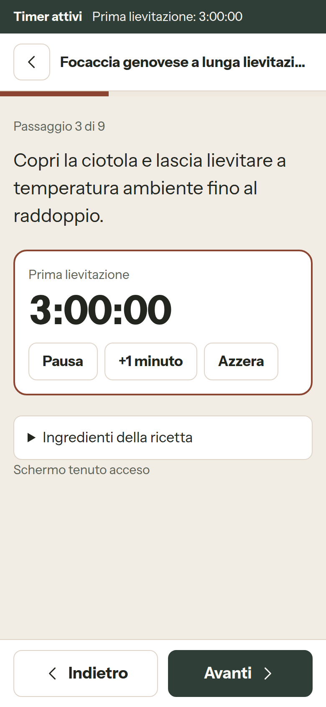
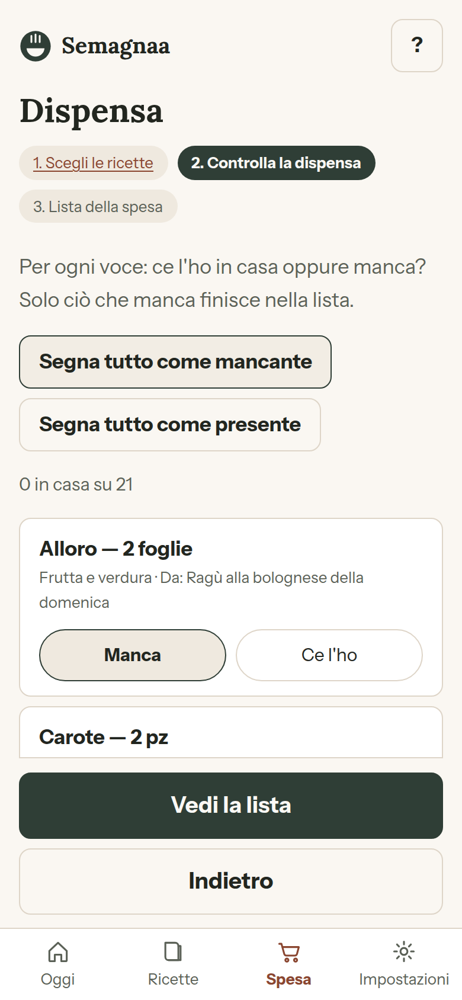
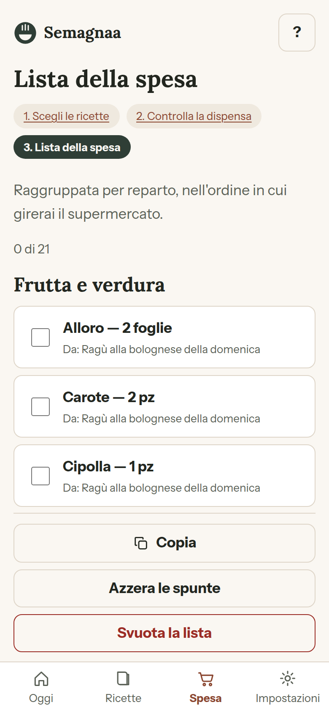

# Semagnaa

App personale di cucina: archivio ricette, **modalità Cucina** passo a passo con timer,
**modalità Spesa** con checklist della dispensa. Funziona **offline**, si installa sul
telefono come app (PWA), non ha backend e non manda niente a nessuno: i dati stanno sul
dispositivo.

- Costruita con [Astro](https://astro.build) in output statico, TypeScript `strict`, CSS puro.
- Nessuna dipendenza runtime oltre ad Astro. Nessun font o script da domini terzi.
- Pubblicata su GitHub Pages da `.github/workflows/deploy.yml`.

| | | |
|---|---|---|
|  |  |  |
| Oggi | Dettaglio con porzioni scalabili | Modalità Cucina con timer |
|  |  | |
| Checklist dispensa | Lista per reparto | |

---

## Indice

1. [Avvio rapido](#avvio-rapido)
2. [Come si usa l'app](#come-si-usa-lapp)
3. [Installarla sul telefono](#installarla-sul-telefono)
4. [Pubblicazione su GitHub Pages](#pubblicazione-su-github-pages)
5. [Aggiungere una ricetta](#aggiungere-una-ricetta)
6. [Struttura del progetto](#struttura-del-progetto)
7. [Cosa personalizzare](#cosa-personalizzare)
8. [Cambiare tecnologia di storage](#cambiare-tecnologia-di-storage)
9. [Aggiungere una lingua](#aggiungere-una-lingua)
10. [Verifiche](#verifiche)
11. [Limiti noti](#limiti-noti)

---

## Avvio rapido

Serve Node.js 22 LTS o successivo.

```bash
npm install
npm run dev        # http://localhost:4321/Semagnaa/
```

Altri comandi:

| Comando | Cosa fa |
|---|---|
| `npm run dev` | server di sviluppo |
| `npm run build` | costruisce `dist/` e genera la precache del service worker |
| `npm run preview` | serve `dist/` come lo servirà GitHub Pages |
| `npm run check` | type check di Astro e TypeScript |
| `npm test` | test della logica (timer, unità, spesa, validazione) |
| `npm run verifica:pagine` | tutte le pagine costruite rispondono 200 |
| `npm run verifica:dipendenze` | nessuna dipendenza runtime estranea, nessun dominio terzo |
| `npm run verifica:flussi` | flussi funzionali in un browser vero (crea ricetta → cucina → spesa) |
| `npm run verifica:responsive` | screenshot a 360/768/1280 px con controllo di overflow |
| `npm run verifica:offline` | apre ogni schermata a rete staccata |

Le ultime tre usano Playwright, che **non** è una dipendenza dell'app: installalo solo
se vuoi rilanciarle (`npm i -D playwright && npx playwright install chromium`).

Il service worker si registra solo sul build (`npm run preview`), non in `dev`: in
sviluppo darebbe solo cache da svuotare a mano.

### Base path

L'app vive sotto `https://<utente>.github.io/<repo>/`, quindi la base non è `/`:

```bash
BASE_PATH=/Semagnaa/ npm run build   # default
BASE_PATH=/ npm run build            # dominio dedicato
```

Nel codice **nessun percorso assoluto è scritto a mano**: tutto passa da
`src/lib/percorsi.ts`, che legge `import.meta.env.BASE_URL`.

---

## Come si usa l'app

**Oggi** (`/`) — preferite, ricette aperte di recente, ripresa di una sessione di cucina
interrotta, scorciatoie a spesa e nuova ricetta.

**Ricette** (`/ricette/`) — ricerca per nome, tag o ingrediente e filtro per categoria.

**Dettaglio** (`/ricetta/?id=...`) — ingredienti con **porzioni scalabili** (le quantità si
ricalcolano), passaggi, tempi, preferita, modifica, eliminazione, "aggiungi alla spesa".

**Cucina** (`/cucina/?id=...`) — un passaggio per schermata, testo grande, avanti/indietro
grandi come il pollice. Dove serve c'è il timer:

- il tempo residuo è calcolato su **timestamp assoluti**: se blocchi lo schermo o esci
  dall'app, al rientro il tempo mancante è quello vero;
- **più timer insieme** (forno e pasta) restano visibili nella barra in alto anche
  cambiando passaggio;
- alla scadenza: tre bip generati via Web Audio, vibrazione dove c'è, e messaggio
  annunciato ai lettori di schermo;
- lo schermo resta acceso finché un timer è in corso (Screen Wake Lock, dove supportato);
- la sessione è salvata a ogni tocco: se chiudi l'app, ti propone di riprendere.

**Spesa** in tre passi:

1. `/spesa/` scegli le ricette e le porzioni;
2. `/spesa/dispensa/` per ogni ingrediente aggregato dici **"ce l'ho"** o **"manca"**;
3. `/spesa/lista/` resta solo ciò che manca, raggruppato per reparto nell'ordine in cui si
   gira il supermercato, spuntabile, con copia e condivisione.

Le quantità si sommano solo dove ha senso: `g` con `kg`, `ml` con `l`. Grammi e cucchiai
restano voci separate, `q.b.` compare una volta sola e senza numero.

**Impostazioni** (`/impostazioni/`) — tema, esportazione e importazione JSON, ricarica
delle ricette di esempio, azzeramento dei dati.

---

## Installarla sul telefono

**Android (Chrome)**: apri l'indirizzo dell'app, menu ⋮ → *Installa app* (o *Aggiungi a
schermata Home*).

**iPhone (Safari)**: apri l'indirizzo, tasto Condividi → *Aggiungi alla schermata Home*.
Su iOS l'installazione funziona solo da Safari.

Dopo la prima apertura l'app funziona in aereo: pagine, ricette e liste sono già sul
dispositivo.

---

## Pubblicazione su GitHub Pages

Una volta sola:

1. Porta il codice sul branch principale: se il repository è ancora sul branch di
   sviluppo, `Settings` → `Branches` → rinomina il branch in `main`, oppure aprine
   una pull request e uniscila. Il workflow ascolta `main` (o `master`).
2. `Settings` → `Pages` → **Source: GitHub Actions**.
3. Push sul branch `main`. In alternativa, da un branch qualsiasi:
   `Actions` → *Pubblica su GitHub Pages* → **Run workflow**.

Il workflow lancia `npm run check`, `npm test`, poi `npm run build` con
`BASE_PATH=/<nome-repo>/` e pubblica `dist/`. L'indirizzo finale è
`https://<utente>.github.io/<nome-repo>/`.

Con un dominio dedicato: metti `BASE_PATH: /` nel workflow e il dominio in `SITE_URL`.

---

## Aggiungere una ricetta

### Dal telefono (il modo normale)

`Ricette` → **Nuova ricetta**. Ingredienti e passaggi si aggiungono, si riordinano e si
rimuovono uno per uno; nel passaggio puoi mettere un timer in minuti. Al salvataggio la
ricetta viene validata e finisce nell'archivio del dispositivo.

### Come ricetta "di esempio" nel repository

Le ricette in `src/content/ricette/*.md` sono quelle fornite con l'app: vengono validate
**in fase di build** e copiate nell'archivio al primo avvio. Se un campo manca o è
scritto male, `npm run build` **fallisce** — è la rete di sicurezza voluta.

Crea un file, per esempio `src/content/ricette/pesto-di-basilico.md`:

```markdown
---
# Titolo mostrato nell'app. Obbligatorio, massimo 90 caratteri.
titolo: Pesto di basilico
# Una di: antipasti, primi, secondi, contorni, dolci, lievitati, basi.
categoria: basi
# Porzioni della ricetta come è scritta: è la base per scalare le quantità.
porzioni: 4
# Minuti di preparazione e di cottura (numeri interi, anche 0).
tempoPreparazioneMin: 15
tempoCotturaMin: 0
# Una di: facile, media, impegnativa.
difficolta: facile
# Massimo 200 caratteri. Se contiene ":" va messa tra virgolette doppie.
descrizione: Solo mortaio e pazienza, niente frullatore che scalda le foglie.
# Etichette libere, servono alla ricerca. Massimo 12.
tags: [base, veloce, vegetariano]
# true la mette tra le preferite in home.
preferita: false
# Data della ricetta (AAAA-MM-GG). Obbligatoria.
data: 2026-03-10
# Facoltativa: da dove viene la ricetta.
fonte: Nonna Elsa
ingredienti:
  # `nome` e `reparto` sono obbligatori. `quantita` e `unita` no.
  - nome: Basilico
    quantita: 50
    unita: g            # g, kg, ml, l, cucchiai, cucchiaini, pezzi, spicchi, foglie, qb
    reparto: frutta-verdura
  - nome: Pinoli
    quantita: 30
    unita: g
    reparto: dispensa
  - nome: Parmigiano reggiano
    quantita: 60
    unita: g
    reparto: latticini
    note: grattugiato al momento   # facoltativa
  - nome: Aglio
    quantita: 1
    unita: spicchi
    reparto: frutta-verdura
  - nome: Olio extravergine di oliva
    quantita: 100
    unita: ml
    reparto: dispensa
  - nome: Sale grosso
    unita: qb           # "quanto basta": nessuna quantità
    reparto: dispensa
passaggi:
  # `testo` è obbligatorio. `timerSecondi` e `timerEtichetta` sono facoltativi:
  # se ci sono, in modalità Cucina compare il timer avviabile.
  - testo: Pesta aglio e sale grosso nel mortaio fino a ottenere una crema.
  - testo: Aggiungi il basilico poche foglie alla volta, con movimento rotatorio.
    timerSecondi: 600
    timerEtichetta: Pestatura
  - testo: Unisci pinoli e parmigiano, poi l'olio a filo mescolando.
---

Le note dopo il frontmatter sono facoltative e compaiono nella sezione "Note".
```

Reparti ammessi (nell'ordine in cui compaiono nella lista della spesa):
`frutta-verdura`, `panetteria`, `carne-pesce`, `latticini`, `surgelati`, `dispensa`,
`bevande`, `altro`.

Poi:

```bash
npm run build     # se il file ha errori, fallisce qui con il campo colpevole
```

Le ricette di esempio già presenti sull'app non vengono sovrascritte ai riavvii. Per
farsi arrivare quelle nuove: alza `VERSIONE_SEED` in `src/lib/seed.ts` (oppure, dal
telefono, *Impostazioni → Ricarica le ricette di esempio*).

---

## Struttura del progetto

```
├── PLAN.md                     piano di lavoro e decisioni prese
├── PROMPT.md                   il prompt da cui è nato il progetto
├── RESULTS.md                  esito reale delle verifiche
├── astro.config.mjs            base path, i18n, output statico
├── .github/workflows/deploy.yml pubblicazione su GitHub Pages
├── public/
│   ├── fonts/                  WOFF2 self-hosted (+ licenze OFL)
│   ├── icone/                  icone PWA (SVG, PNG 192/512, maskable)
│   ├── sw.js                   service worker scritto a mano
│   ├── favicon.svg
│   └── robots.txt
├── scripts/
│   ├── gen-precache.mjs        post-build: elenco precache dentro dist/sw.js
│   ├── check-pages.mjs         verifica che tutte le pagine rispondano 200
│   └── check-no-deps.mjs       verifica dipendenze e domini terzi
└── src/
    ├── components/             Icona, BarraNav, Marchio, Avvio
    ├── content/ricette/        una ricetta di esempio per file .md
    ├── content.config.ts       schema Zod (fa fallire la build se sbagliato)
    ├── i18n/it.json            TUTTE le stringhe di interfaccia
    ├── layouts/Base.astro      guscio comune, meta PWA
    ├── lib/
    │   ├── tipi.ts             modello dati, fonte di verità degli enum
    │   ├── archivio.ts         interfaccia di persistenza (astratta)
    │   ├── archivio-locale.ts  unica implementazione (localStorage)
    │   ├── timer.ts            timer puri, su timestamp assoluti
    │   ├── unita.ts            conversioni e somme di quantità
    │   ├── spesa.ts            aggregazione ingredienti → lista
    │   ├── scala.ts            scalatura porzioni
    │   ├── validazione.ts      validazione editor e importazione
    │   ├── seed.ts             primo caricamento delle ricette di esempio
    │   ├── sessione.ts         sessione della modalità Cucina
    │   ├── suono.ts            bip Web Audio, vibrazione, schermo acceso
    │   ├── viste.ts            pezzi di interfaccia lato client
    │   └── *.test.ts           test con il runner nativo di Node
    ├── pages/                  una cartella per schermata
    └── styles/global.css       design system in custom properties
```

---

## Cosa personalizzare

| Cosa | Dove |
|---|---|
| Nome, tagline, descrizione dell'app | `src/i18n/it.json` → `app.*` |
| Ogni testo dell'interfaccia | `src/i18n/it.json` (non ci sono stringhe nei componenti) |
| Colori, tipografia, spaziature | `src/styles/global.css`, blocco `:root` (e i due blocchi del tema scuro) |
| Ricette di esempio | `src/content/ricette/*.md` — cancellale tutte se vuoi partire da zero |
| Reparti del supermercato e loro ordine | `REPARTI` in `src/lib/tipi.ts` + etichette in `it.json` → `reparti` |
| Categorie e unità di misura | `CATEGORIE` / `UNITA` in `src/lib/tipi.ts` + etichette in `it.json` |
| Icone e favicon | `public/icone/`, `public/favicon.svg` (le PNG si rigenerano dall'SVG) |
| Nome del repository / base path | `astro.config.mjs` (`BASE_PATH`) e il workflow |
| Versione mostrata nelle impostazioni | `src/lib/versione.ts` |

---

## Cambiare tecnologia di storage

`src/lib/archivio.ts` definisce l'interfaccia e **non nomina nessuna tecnologia**;
`src/lib/archivio-locale.ts` è l'unica implementazione e l'unico file che può nominare
`localStorage`. L'ultima riga di `archivio.ts` è il solo punto di collegamento:

```ts
export { archivioLocale as archivio } from './archivio-locale.ts';
```

Per passare a IndexedDB:

1. crea `src/lib/archivio-indexeddb.ts` che esporta un oggetto `Archivio`
   (`leggiRicette`, `leggiRicetta`, `salvaRicetta`, `cancellaRicetta`,
   `sostituisciRicette`, `unisciRicette`, `leggiStato`, `scriviStato`,
   `rimuoviStato`, `azzeraTutto`, `disponibile`) — l'interfaccia è già asincrona,
   quindi non cambia nessuna firma;
2. cambia quella riga in
   `export { archivioIndexedDb as archivio } from './archivio-indexeddb.ts';`
3. `npm run check && npm test`.

Nessuna pagina, nessun componente va toccato. La verifica 10b in `RESULTS.md`
controlla proprio che nessun altro file usi `localStorage`.

---

## Aggiungere una lingua

L'app è solo in italiano ma non ha stringhe nel codice.

1. `cp src/i18n/it.json src/i18n/en.json` e traduci **i valori** (le chiavi no).
2. In `src/i18n/index.ts` aggiungi il dizionario:
   ```ts
   import en from './en.json';
   const dizionari = { it, en } as const;
   ```
3. In `astro.config.mjs`: `locales: ['it', 'en']`. `defaultLocale` resta `'it'` e
   `prefixDefaultLocale: false`, quindi gli URL italiani non cambiano e l'inglese
   vive sotto `/en/`.
4. Duplica le pagine sotto `src/pages/en/` (o introduci una route dinamica per la
   lingua) e passa la lingua a `d(lingua)` invece di usare `T`.

I contenuti delle ricette restano nella lingua in cui li hai scritti: sono dati
dell'utente, non interfaccia.

---

## Verifiche

L'esito reale di tutte le verifiche, con l'output dei comandi, è in
[`RESULTS.md`](./RESULTS.md). In sintesi:

```bash
npm run build                      # 1. build
npm run check                      # 2. type check
npm run preview &                  # 3. pagine raggiungibili
npm run verifica:pagine
npm test                           # 10. logica
npm run verifica:dipendenze        # 12. dipendenze e domini terzi
npm audit --audit-level=high       # 13. vulnerabilità
npm run verifica:responsive        # 14. nessun overflow a 360/768/1280
npm run verifica:flussi            # 16. flussi funzionali end-to-end
npm run verifica:offline           # 17. tutte le schermate a rete staccata
```

Il tutto gira anche con la base alla radice, per il caso "dominio dedicato":

```bash
BASE_PATH=/ npm run build && BASE_PATH=/ npm run preview
BASE_PATH=/ node scripts/check-pages.mjs --base http://localhost:4321/
```

---

## Limiti noti

- **I dati stanno nel browser del dispositivo.** Cancellare i dati del sito cancella le
  ricette: usa *Impostazioni → Esporta* per tenere una copia. Non c'è sincronizzazione
  tra dispositivi (per progetto: nessun server).
- **L'aggregazione della spesa confronta i nomi normalizzati** (minuscole, accenti,
  spazi): "pomodoro" e "pomodori" restano due voci. Scrivi gli ingredienti sempre nello
  stesso modo, o correggi la lista a mano.
- **Screen Wake Lock non c'è su iOS**: lo schermo può spegnersi durante la cottura. I
  timer restano corretti perché calcolati su timestamp assoluti.
- **Le notifiche di sistema non sono usate**: se l'app è chiusa il bip non suona. Alla
  riapertura il timer è già segnato come scaduto.
- **Unità non convertibili non vengono sommate** (grammi e cucchiai): è voluto, meglio due
  voci che una somma sbagliata.
